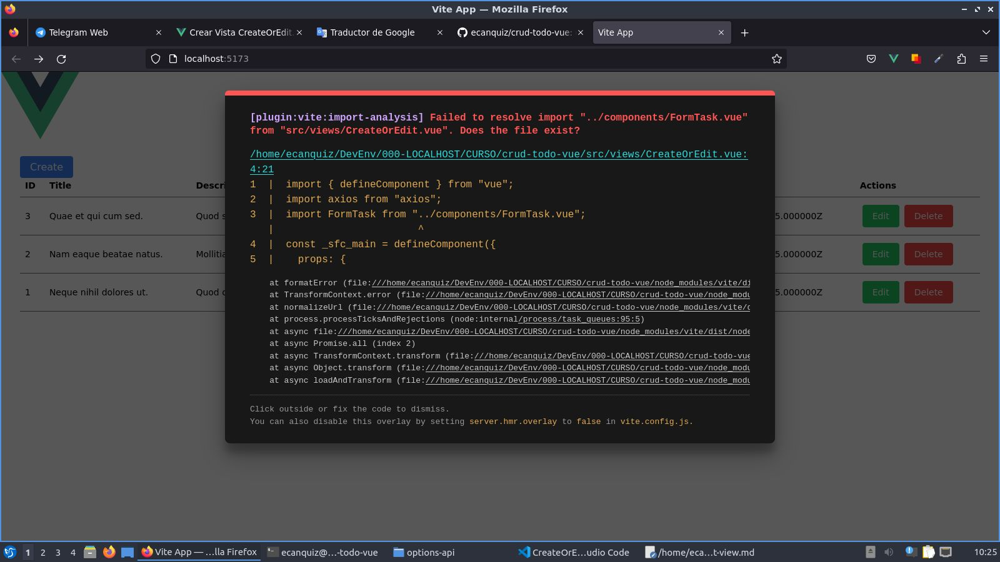

# Crear Vista `CreateOrEdit.vue`

>Esta vista funcionará tanto para crear tareas como para editarlas.

Cópie y pegue el siguiente código en la vista respectiva.

📃`./views/CreateOrEdit.vue`
```vue{8,19,24,25,31,40,50,65}
<script lang="ts">
import { defineComponent } from 'vue'
import axios from 'axios'
import FormTask from '../components/FormTask.vue'

export default defineComponent({
  props: {
    id: String
  },
  components: {
    FormTask
  },
  data() {
    return {
      task: {}
    }
  },
  mounted() {
    if (this.$props.id)
      this.getTask();
  },
  computed: {
    isRenderable() {
        return (this.$props.id && Object.keys(this.task).length > 0)
          || this.$props.id===undefined
    }
  },  
  methods: {
    getTask() {
      axios
        .get(`http://localhost:8000/api/tasks/${this.$props.id}`)
        .then(response => this.task = response.data )
        .catch(
          error => console.log({
            errorCode: error.code, errorMessage: error.message
          })
        );
    },
    submit(payload) {
      if (this.$props.id===undefined) {
        axios
          .post("http://localhost:8000/api/tasks", payload)
          .then(response => (
            this.$router.push({name: 'index'})            
          ))
          .catch(error => console.log(error))
          //.finally(() => this.pending = false)*/
      } else {
        axios
          .put(`http://localhost:8000/api/tasks/${this.$props.id}`, payload)
          .then(response => (
            this.$router.push({name: 'index'})            
          ))
          .catch(error => console.log(error))
          //.finally(() => this.pending = false)*/
      }
    }  
  }
})
</script>

<template>
  <div class="container row col-md-6 mx-auto w-1/2">
    <h1 class="text-2xl" align="center">
      {{$props.id ? 'Editing' : 'Creating'}} Tast
    </h1>
    <FormTask v-if="isRenderable" :task="task" @submit='submit' />
  </div>
</template>
```

Tenga en cuenta que la página `CreateOrEdit.vue` permite crear nuevas tareas y edita tareas existentes, a su vez permite modificarlas. Para tal fin, recuerde que cuando [creamos las rutas](../vue/create-routes.html) establecimos el parametro `id` de la ruta `edit/` como una propiedad. Observe las líneas resaltadas del código anterior para que tenga idea de cómo hacer que esto resulte.

## Componente (temporal)

Ahora, si intentamos crear una nueva tarea o editar algunona ya existente el navegador mostrará un error:



Y es que esta vista tiene un componente hijo que no hemos creado aún.


Para que deje de aparecer en pantalla el error anterior debemos crear el componente (brevemente vacio) `FormTask.vue` en la carpeta `./componentes/`.

📃`./componentes/FormTask.vue`
```vue
<script lang="ts">
</script>

<template>
</template>
```

Sigamos adelante creando el componente `FormTask.vue`

