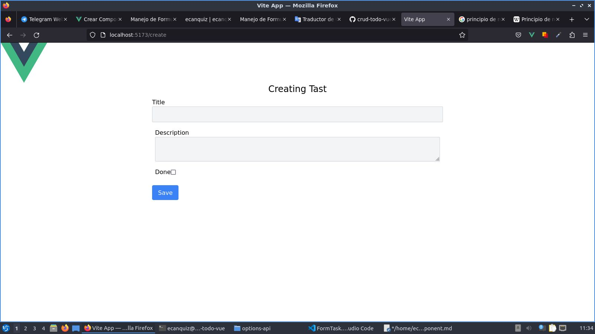
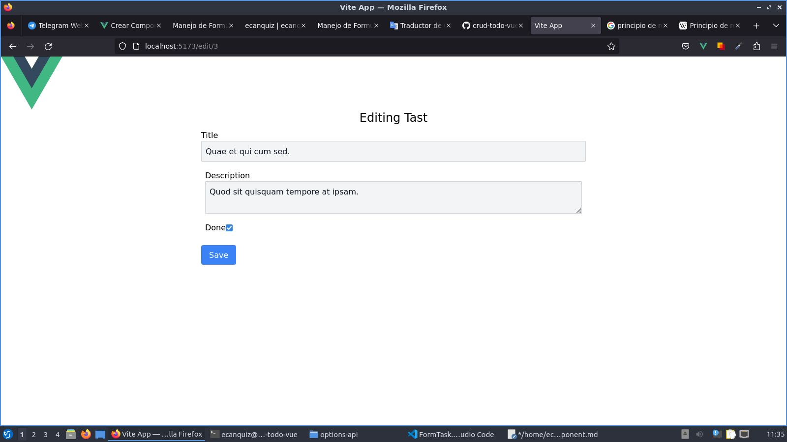

# Crear Componente `FormTask.vue`

>Seguramente se preguntará porqué separamos el formulario de la vista. En este sentido, siguiendo [el principio de responsabilidad única](https://es.wikipedia.org/wiki/Principio_de_responsabilidad_%C3%BAnica), esta separación es un patrón recomendado para cuando llegue el momento de elaborar nuestras [pruebas automatizadas](https://ecanquiz.github.io/vue-tdd/vtu/esencial/formularios.html).

Cópiemos y peguemos el siguiente código en el componente `FormTask.vue`

📃`./components/FormTask.vue`
```vue
<script lang="ts">
import { defineComponent } from 'vue'

export default defineComponent({
  props: {
    task: Object    
  },
  data() {
    return {
      form: this.$props.task
    }
  },
  emits: ['submit'],
  methods: {
    submit() {          
      this.$emit('submit', this.form )
    }
  }
})
</script>

<template>
  <form @submit.prevent="submit">
    <div class="m-2">
      <label>Title</label>
      <input type="text" v-model="form.title">
    </div>

   <div class="m-4">
      <label>Description</label>
      <textarea v-model="form.description"></textarea>
    </div>

    <div class="m-4">
      <label>Done</label>
      <input type="checkbox" v-model="form.done"/>
    </div>

    <button type="submit" class="btn btn-primary m-2">
      Save
    </button>
  </form>
</template>
```

Llegado a este ya tenemos un **CRUD ToDo** completamente funcional. [Lista y Elimina Tareas](../options-api/create-index-view.html) y ahora Crea Tareas.



Y también Edita Tareas.



>Sin embargo, reconocemos que aún hay cosas en nuestro código que _"huelen un poco mal"_. Por lo que ahora vamos a limpiar y refactorizar nuestro código.

Avancemos con la creación de Servicios y la definición de Tipos...

