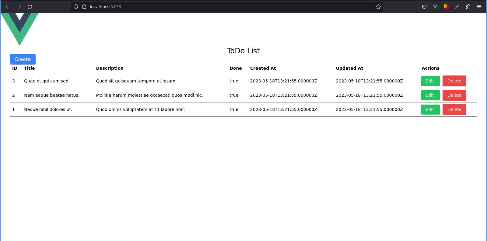

# Crear Vista `Index.vue`

Empezaremos con la vista (o página) que renderizará el listado de tareas.

📃`./views/Index.vue`
```vue
<script lang="ts">
import { defineComponent } from 'vue'
import axios from 'axios'

export default defineComponent({
  data() {
    return {
      tasks: []
    }
  },
  mounted() {
    this.getTasks();
  },
  methods: {
    getTasks() {
      axios
        .get('http://localhost:8000/api/tasks')
        .then(response => this.tasks = response.data )
        .catch(
          error => console.log({
            errorCode: error.code, errorMessage: error.message
          })
        );
    },
    removeTask(id) {
      axios
        .delete(`http://localhost:8000/api/tasks/${id}`)
        .then(response => {
          console.log({ statusCode: response.status })
          if (response.status===204)
            this.getTasks();
          })
        .catch(
          error => console.log({
            errorCode: error.code, errorMessage: error.message
          })
        );
    }
  }
})
</script>

<template>
  <div class="container mx-auto">
    <h1 class="text-2xl" align="center">ToDo List</h1>    
    <router-link
      :to="{name: 'create'}"
      class="btn btn-primary"
      >Create
    </router-link>
    <table class="min-w-full text-left text-sm font-light">
      <thead class="border-b font-medium dark:border-neutral-500">
        <tr>
          <th class="p-2">ID</th>
          <th class="p-2">Title</th>
          <th class="p-2">Description</th>
          <th class="p-2">Done</th>
          <th class="p-2">Created At</th>
          <th class="p-2">Updated At</th>
          <th class="p-2">Actions</th>
        </tr>
      </thead>
      <tbody>
        <tr
          v-for="task in tasks"
          :key="task.id"
          class="border-b dark:border-neutral-500"
        >
          <td class="p-2">{{ task.id }}</td>
          <td class="p-2">{{ task.title }}</td>
          <td class="p-2">{{ task.description }}</td>
          <td class="p-2">{{ task.done }}</td>
          <td class="p-2">{{ task.created_at }}</td>
          <td class="p-2">{{ task.updated_at }}</td>          
          <td class="p-2">
            <button
              class="btn btn-success m-1 text-sm"
              @click="$router.push({name: 'edit', params: {id: task.id}})"
            >
              Edit
            </button>
            <button
              class="btn btn-danger m-1 text-sm"
              @click="removeTask(task.id)"
            >
              Delete
            </button>
          </td>
        </tr>
      </tbody>
    </table>
    <h4 v-if="tasks.length === 0">Empty list.</h4>
  </div>
</template>
```

Con este componente creado ya deberiamos de poder ver el listado de tareas en nuestro navegador. 

>Tenga en cuenta que el backend que funciona como API debe estar trabajando.

Nuestra SPA debería lucir así:



>Ya esta página esta en la capacidad de mostrar las tareas y eliminarlas.

Continuemos con la vista `CreateOrEdit.vue`
