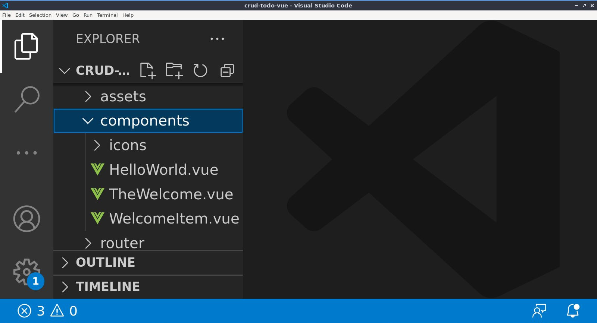
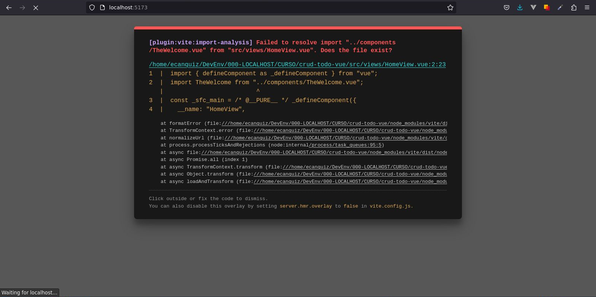
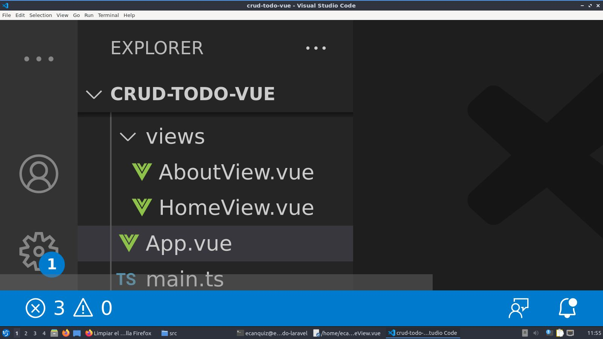
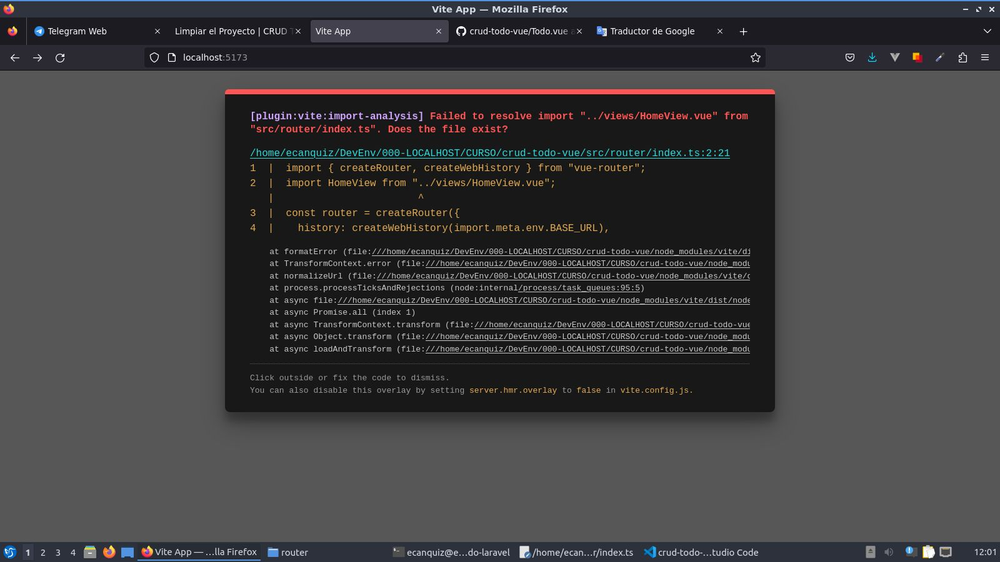

# Limpiar el Proyecto

Vaciemos la carpeta `./components` eliminando todo su contenido, ya que no la necesitaremos.



Inmediatamente aparecerá un error en la pantalla como el siguiente:



No se preocupe. Vayamos al archivo `./App.vue` y comentemos las siguientes líneas resaltadas.

📃`./App.vue`
```vue{3,11,13,14,15,16}
<script setup lang="ts">
import { RouterLink, RouterView } from 'vue-router'
//import HelloWorld from './components/HelloWorld.vue'
</script>

<template>
  <header>
    

    <div class="wrapper">
      <!--HelloWorld msg="You did it!" /-->

      <!--nav>
        <RouterLink to="/">Home</RouterLink>
        <RouterLink to="/about">About</RouterLink>
      </nav-->
    </div>
  </header>

  <RouterView />
</template>
```

Todavía falta comentar algo en otro archivo. Se trata de la vista `HomeView.vue`.

📃`./views/HomeView.vue`
```vue{2,7}
<script setup lang="ts">
//import TheWelcome from '../components/TheWelcome.vue'
</script>

<template>
  <main>
    <!--TheWelcome /-->
  </main>
</template>
```

>No dude en eliminar esas líneas que acabamos de comentar, no serán necesarias.

Desocupemos tambíen el contenido de la carpeta `./views`. Es decir, eliminemos los archivos `AboutView.vue` y `HomeView.vue` dejando la carpeta completamente vacía. 



Aparecerá otro error...



>Pero este error lo trataremos en la siguiente sección.

Por ahora, es todo lo que tenemos por limpiar.
