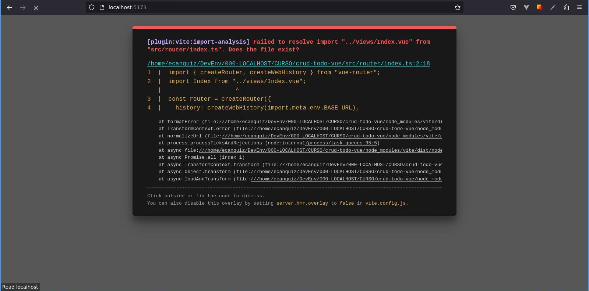

# Crear Rutas

>Epecemos por crear las correspondientes rutas para acayar el error de la sección anterior.

## Rutas

Vayamos al archivo de rutas y remplacemos el código con lo siguiente.

`./router/index.ts`
```ts
import { createRouter, createWebHistory } from 'vue-router'
import Index from '../views/Index.vue'
import CreateOrEdit from '../views/CreateOrEdit.vue'

const router = createRouter({
  history: createWebHistory(import.meta.env.BASE_URL),
  routes: [
    {
      path: '/',
      name: 'index',
      component: Index
    },
    {
      path: '/create',
      name: 'create',
      component: () => import('../views/CreateOrEdit.vue'),
      props: true
    },
    {
      path: '/edit/:id(\\d+)',      
      name: 'edit',
      component: () => import('../views/CreateOrEdit.vue'),
      props: true
    }
  ]
})

export default router
```

>Tenga en cuenta que implementaremos el mismo componente `CreateOrEdit.vue` tanto para **crear** tareas como para **editarlas**.

Ahora nos aparecerá otro error, no se preocupe.
 


Este error es porque aún no hemos creado los componentes `Index.vue` y `CreateOrEdit.vue` los cuales representarán nuestras vistas.

## Vistas (temporales)

Para que deje de aparecer el error debemos crear los componentes (brevemente vacios) `Index.vue` y `CreateOrEdit.vue` en la carpeta `.\views` los cuales representarán las vistas respectivamente.

`./views/Index.vue`
```vue
<script lang="ts"></script>

<template></template>
```
`./views/CreateOrEdit.vue`
```vue
<script lang="ts"></script>

<template></template>
```

Dichas vistas (o páginas) las construiremos en las siguientes secciones de este tutorial...
