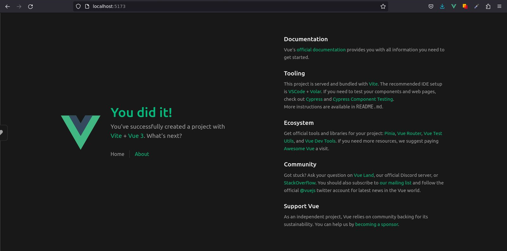
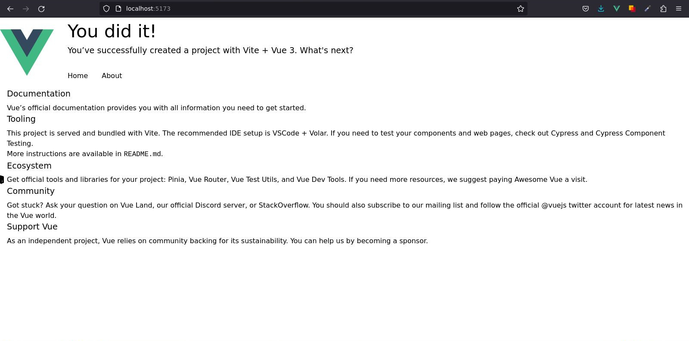

# Nuevo Proyecto Vue

## Instalando Vue

```sh
npm init vue@latest
```

Lo primero que nos preguntará el CLI es establecer el nombre del proyecto, siéntase libre de colocar el nombre del proyecto de su preferencia.

```sh
? Project name: › vue-project
```

En mi caso, colocaré el nombre del proyecto: `crud-todo-vue`. Inmediatamente el CLI nos hará una serie de preguntas que definirán las características generales del proyecto. 

:::info Nota
Para cumplir con el objetivo de este tutorial, seleccione solo las opciones que aparecen resaltadas en el siguiente código:
```sh{1,2,4}
✔ Project name: … crud-todo-vue
✔ Add TypeScript? … Yes
✔ Add JSX Support? … No
✔ Add Vue Router for Single Page Application development? … Yes
✔ Add Pinia for state management? … No
✔ Add Vitest for Unit Testing? … No
✔ Add an End-to-End Testing Solution? › No
✔ Add ESLint for code quality? … No
```
:::

Perfecto, ya nuestro andamiaje ha sido creado:

```sh
Scaffolding project in /home/ecanquiz/crud-todo-vue...

Done. Now run:
```
## Hecho. Ahora ejecuta:

Para finalizar la instalación de Vue, siga las instrucciones, paso por paso, ejecutando lo siguiente:
```sh
cd todo-spa
npm install
npm run dev
```

Con la instrucción `cd todo-spa` entramremos en la carpeta del proyecto que acabamos de crear. Luego ejecutamos `npm install` para instalar las dependencias de Vue y después levantamos nuestro proyecto con `npm run dev` en modo desarrollo. En la terminal verá lo siguiente.

```sh
  VITE v4.3.5  ready in 419 ms

  ➜  Local:   http://localhost:5173/
  ➜  Network: use --host to expose
  ➜  press h to show help
```

Si en su navegador coloca la ruta `http://localhost:5173/` vera su nueva SPA con Vue corriendo.



## Instalando TailwindCss
Instale **tailwindcss** y sus dependencias de pares a través de `npm` y luego ejecute el comando `init` para generar tanto `tailwind.config.js` como `postcss.config.js`.

```sh
npm install -D tailwindcss postcss autoprefixer
npx tailwindcss init -p
```

A continuación, agregue las rutas a todos sus archivos de plantilla en el archivo `tailwind.config.js` ubicado en la raiz del proyecto.

📃`tailwind.config.js`
```js{4,5}
/** @type {import('tailwindcss').Config} */ 
module.exports = {
  content: [
    "./index.html",
    "./src/**/*.{vue,js,ts,jsx,tsx}",
  ],
  theme: {
    extend: {},
  },
  plugins: [],
}
```

Ahora cree un archivo `./src/assets/app.css` y agregue las directivas `@tailwind` para cada una de las capas de Tailwind.

📃`./src/assets/app.css`
```css
@tailwind base;
@tailwind components;
@tailwind utilities;
```

Importe el archivo `./src/index.css` recién creado en su archivo `./src/main.ts`.

📃`./src/main.ts`
```ts
// import './assets/main.css'
import './assets/app.css'

import { createApp } from 'vue'
import App from './App.vue'
import router from './router'

const app = createApp(App)

app.use(router)

app.mount('#app')
```
Note que para el objetivo del tutorial no necesitaremos el archivo `./assets/main.css`.

Ahora nuestra SPA tendrá la siguente apariencia.



Excelente, ya hemos instalado TailwindCss !!

## Agregar código CSS

Para que las plantillas de los SFC que construiremos queden un poco más limpias, cópie y peque el código resaltado en su archivo `./src/assets/app.css`.

📃`./src/assets/app.css`
```css{5,6,7,8,9,10,11,13,14,15,16,17,18,19,20,21,22,23,24,25,26,27,28,29}
@tailwind base;
@tailwind components;
@tailwind utilities;

.btn { @apply text-white py-2 px-4 rounded transition; }
.btn-danger { @apply bg-red-500 hover:bg-red-700; }
.btn-default { @apply bg-gray-500 hover:bg-gray-700; }
.btn-primary { @apply bg-blue-500 hover:bg-blue-700; }
.btn-success { @apply bg-green-500 hover:bg-green-700; }
.btn-xs { @apply text-xs px-2; }
.a-link { @apply text-indigo-600 hover:text-indigo-800 underline; }

input[type="text"],
input[type="email"],
input[type="url"],
input[type="password"],
input[type="number"],
input[type="date"],
input[type="datetime-local"],
input[type="month"],
input[type="search"],
input[type="tel"],
input[type="time"],
input[type="week"],
input[multiple],
textarea,
select {
  @apply block w-full rounded-sm border border-gray-300 shadow-sm p-2 bg-gray-100 text-gray-900;
}
```

## Instalando Axios

Para finalizar las instalaciones de dependencias ejecute lo siguiente.

```sh
npm i axios
```

Con este paquete haremos las solicitudes HTTPRequest a el backend (API) para acceder a los datos (tareas).

